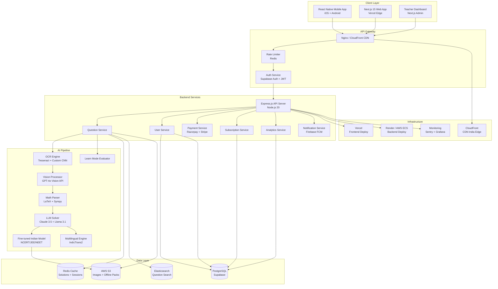

# Phase 3 — Technical Architecture

**Agents**: AI/ML Architect (Agent 5) | Backend Engineer (Agent 6) | Frontend Engineer (Agent 7) | UI/UX Designer (Agent 8)

---

## System Architecture (Mermaid)



---

## Agent 5: AI/ML Pipeline Architecture

### Multi-Modal Solve Pipeline

```
User Photo → Image Preprocessing → OCR/Vision → Question Understanding → Solver → Steps Generation → Multilingual Output
```

#### Step 1: Image Preprocessing
- **Input**: Camera photo or gallery upload (JPEG/PNG, up to 10MB)
- **Processing**: Auto-crop, deskew, contrast enhancement, noise removal
- **Tech**: OpenCV (via sharp/jimp in Node.js), client-side preprocessing in React Native
- **Optimization**: Compress to 500KB before upload (saves data for Indian users)

#### Step 2: OCR + Vision Engine
- **Primary**: GPT-4o Vision API (best accuracy on handwritten + printed)
- **Fallback**: Tesseract OCR + custom CNN for Indian scripts
- **Handwriting Model**: Fine-tuned on 100K samples of Indian student handwriting
- **Script Support**: Latin, Devanagari, Tamil, Telugu, Kannada, Bengali, Gujarati
- **Output**: Structured text with LaTeX math notation

#### Step 3: Question Understanding
- **Classification**: Subject (Math/Physics/Chemistry/Biology), Topic, Difficulty
- **Curriculum Mapping**: NCERT chapter-verse, JEE/NEET topic tag
- **Intent Detection**: Solve, explain, prove, compare, derive, graph
- **Context**: Previous questions in session for multi-part problems

#### Step 4: LLM Solver (Multi-Model Strategy)
| Use Case | Model | Cost/1K tokens | Accuracy Target |
|----------|-------|----------------|-----------------|
| NCERT basic (Class 6-10) | Llama 3.1 70B (self-hosted) | $0.001 | 99%+ |
| NCERT advanced (Class 11-12) | Claude 3.5 Sonnet | $0.003 | 99%+ |
| JEE Main | Claude 3.5 + fine-tuned | $0.005 | 98%+ |
| JEE Advanced | GPT-4o + chain-of-thought | $0.01 | 95%+ |
| NEET Biology | Claude 3.5 + curriculum RAG | $0.005 | 98%+ |
| Handwriting OCR | GPT-4o Vision | $0.01 | 97%+ |
| Regional language | IndicTrans2 + Llama | $0.002 | 95%+ |

#### Step 5: Step-by-Step Generation
- Each step tagged with: concept name, formula used, difficulty level
- "Why" annotations: explains reasoning, not just mechanics
- Alternative methods when applicable
- Related PYQ (Previous Year Questions) references

#### Step 6: Learn Mode Evaluation
- After showing steps 1-3, prompt student to explain
- AI evaluates response for conceptual understanding
- Scoring: 0-100% understanding score
- If <60%: show hint, re-explain concept, then reveal answer
- If ≥60%: reveal full solution + bonus practice question

### Cost Optimization Strategy
- **Caching**: Redis cache for identical/similar questions (hit rate: ~40% for NCERT)
- **Model Routing**: Use cheapest model that meets accuracy threshold
- **Batching**: Queue non-urgent requests for batch processing
- **Self-hosted**: Llama 3.1 70B on AWS g5.xlarge for basic NCERT ($0.001/solve)
- **Target**: Average cost per solve = ₹0.15 (free tier) to ₹0.50 (advanced)

---

## Agent 6: Backend Architecture

### Tech Stack
- **Runtime**: Node.js 20 LTS + Express.js
- **Database**: PostgreSQL 16 (Supabase hosted) + Prisma ORM
- **Cache**: Redis 7 (Upstash serverless)
- **Auth**: Supabase Auth (Google, phone OTP, email)
- **Payments**: Razorpay SDK + Stripe (international)
- **Storage**: AWS S3 (Mumbai region) for images
- **Search**: Elasticsearch for question bank
- **Notifications**: Firebase Cloud Messaging
- **Monitoring**: Sentry + custom metrics

### Database Schema (Key Tables)

```sql
-- Users
users: id, email, phone, name, class, board, language_pref, created_at
user_profiles: user_id, school_name, city, state, target_exam, avatar_url
subscriptions: user_id, plan, status, razorpay_sub_id, starts_at, ends_at

-- Questions & Solutions
questions: id, user_id, image_url, extracted_text, subject, topic, board, class
solutions: id, question_id, steps_json, final_answer, model_used, confidence, language
solution_cache: question_hash, solution_id, hit_count

-- Learning
learn_mode_attempts: id, solution_id, user_id, student_response, ai_score, passed
progress: user_id, subject, topic, questions_solved, accuracy, streak
weakness_map: user_id, topic, error_count, last_attempted, mastery_level

-- School/Teacher
schools: id, name, board, city, state, admin_user_id
classrooms: id, school_id, teacher_id, name, grade
student_school_map: student_id, classroom_id, enrolled_at

-- Billing
transactions: id, user_id, amount, currency, razorpay_payment_id, status
```

### API Routes

```
Auth:
POST   /api/auth/register          # Phone OTP / Google sign-in
POST   /api/auth/verify-otp        # Verify phone OTP
POST   /api/auth/login             # Email/password login
POST   /api/auth/refresh           # Refresh JWT token

Questions:
POST   /api/questions/solve        # Upload image → get solution
POST   /api/questions/text-solve   # Text input → get solution
GET    /api/questions/history      # User's question history
GET    /api/questions/:id          # Get specific question + solution
POST   /api/questions/:id/learn    # Submit Learn Mode response

Solutions:
GET    /api/solutions/:id          # Get full solution
GET    /api/solutions/:id/steps    # Get step-by-step (paginated for Learn Mode)
POST   /api/solutions/:id/rate     # Rate solution quality

User:
GET    /api/user/profile           # Get user profile
PUT    /api/user/profile           # Update profile
GET    /api/user/progress          # Learning progress dashboard
GET    /api/user/weaknesses        # Weakness analysis
GET    /api/user/streak            # Daily streak info

Subscriptions:
GET    /api/subscriptions/plans    # Available plans
POST   /api/subscriptions/create   # Create Razorpay subscription
POST   /api/subscriptions/webhook  # Razorpay webhook handler
GET    /api/subscriptions/status   # Current subscription status

School (Teacher Dashboard):
POST   /api/school/register        # Register school
GET    /api/school/students        # List students
GET    /api/school/analytics       # Class analytics
GET    /api/school/student/:id     # Individual student report

Search:
GET    /api/search/ncert           # Search NCERT solutions
GET    /api/search/pyq             # Search Previous Year Questions
```

---

## Agent 7: Frontend Architecture

### Mobile App (React Native)
- **Navigation**: React Navigation 7 (tab + stack)
- **State**: Zustand (lightweight, fast)
- **Camera**: react-native-camera + custom crop overlay
- **Offline**: WatermelonDB for local storage
- **Animations**: react-native-reanimated 3
- **Charts**: react-native-chart-kit (progress)
- **i18n**: react-native-localize + custom Indian language pack

### Web App (Next.js 15)
- **Framework**: Next.js 15 App Router
- **Styling**: Tailwind CSS 4 + shadcn/ui
- **State**: Zustand + React Query
- **Auth**: Supabase Auth SSR
- **Deployment**: Vercel (Edge Functions in Mumbai)

### Key Screens (Mobile)
1. **Home** — One-tap camera button, recent doubts, daily streak
2. **Camera** — Full-screen viewfinder, flash, gallery, crop overlay
3. **Solution** — Animated step-by-step, Learn Mode gate, save/share
4. **Progress** — Subject-wise charts, weakness map, streak calendar
5. **NCERT Browser** — Class → Subject → Chapter → Exercise navigation
6. **Mock Tests** — Timed tests, JEE/NEET patterns, instant grading
7. **Profile** — Subscription, settings, language, offline packs
8. **Community** — Ask/answer doubts, leaderboard, reputation

---

## Agent 8: UI/UX Design System

### Design Principles
1. **"One-Tap Solve"** — Camera should be reachable with one thumb
2. **"Bharat-Ready"** — Hindi-first design, RTL-aware for Urdu
3. **"Light as Air"** — Minimal animations, fast render, low-data friendly
4. **"Study Night"** — Beautiful dark mode optimized for late-night studying

### Color Palette
```
Primary:     #6366F1 (Indigo — trust, intelligence)
Secondary:   #F59E0B (Amber — energy, achievement)
Success:     #10B981 (Green — correct answers)
Error:       #EF4444 (Red — wrong answers)
Background:  #FFFFFF (light) / #0F172A (dark)
Surface:     #F8FAFC (light) / #1E293B (dark)
Text:        #1E293B (light) / #F1F5F9 (dark)
```

### Typography
- **English**: Inter (clean, readable on small screens)
- **Hindi**: Noto Sans Devanagari
- **Regional**: Noto Sans [Language] family
- **Math**: KaTeX rendering (fast, consistent)

### Key Component Specs
```
CameraButton:   72px round, primary color, bottom center, pulse animation
SolutionCard:   Full-width, rounded-xl, shadow-sm, step indicators
StepItem:       Left border accent, step number badge, expandable "why"
ProgressRing:   Circular progress, subject color-coded, animated fill
LearnModeGate:  Bottom sheet, textarea, submit button, AI evaluation spinner
StreakBadge:     Fire emoji + day count, top-right of home screen
```
